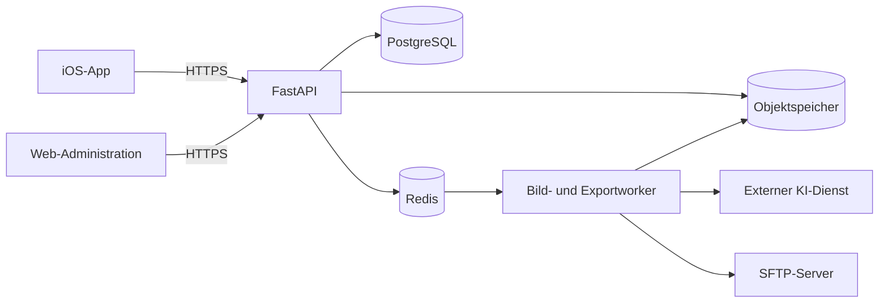

# ShowroomFlow – Architektur

## Leitlinien

- Jeder Datensatz gehoert genau zu einem Autohaus (Mandant).
- Ein Autohaus besitzt mehrere Standorte und Benutzer.
- Die App waehlt Marke und Hintergrund innerhalb der fuer den Standort freigegebenen Konfiguration.
- Aufnahme- und Exportreihenfolge sind getrennt konfigurierbar.
- Original und bearbeitete Version eines Fotos werden 90 Tage aufbewahrt.
- Wiederholte VINs erzeugen neue Auftragsversionen statt vorhandene Auftraege zu ueberschreiben.
- Exporte laufen automatisch oder nach manueller Freigabe; jeder Export kann erneut per SFTP gesendet werden.

## Komponenten

## Zentrale fachliche Objekte

- `Dealership`: Autohaus beziehungsweise Mandant
- `Location`: Standort eines Autohauses
- `User`: Systemadministrator, Autohausadministrator oder Fotograf
- `CaptureTemplate`: konfigurierter Aufnahmeablauf
- `CaptureStep`: Perspektive, Anleitung, Silhouette und Pflichtstatus
- `ExportTemplate`: unabhaengige Reihenfolge von Fotos und Werbebildern
- `Background`: Showroom-Hintergrund mit Marken- und Standortfreigaben
- `Overlay`: transparentes PNG mit Position und Skalierung
- `VehicleJob`: Auftrag aus VIN und interner Versionsnummer
- `PhotoAsset`: Original, Bearbeitung und Zuordnung zur Perspektive
- `ExportRun`: protokollierter SFTP-Export inklusive Wiederholungen

## Dateinamen

- Archiv: `<VIN>.zip`
- Bilder: `<VIN>_01.jpg`, `<VIN>_02.jpg`, `<VIN>_03.jpg` usw.
- Die Nummer richtet sich nach der Exportvorlage, nicht nach dem Aufnahmezeitpunkt.

## Sicherheit

- HTTPS fuer App und Administration
- Passwort-Hashes statt Klartextpasswoerter
- kurzlebige Zugriffstoken und erneuerbare Sitzungstoken
- Mandantenzuordnung bei jeder Datenbankabfrage
- SFTP- und KI-Zugangsdaten nur als verschluesselte Serverkonfiguration
- keine produktiven Geheimnisse in Git oder in der iOS-App
- revisionsfaehiges Protokoll fuer Freigaben, Aenderungen und Exporte
